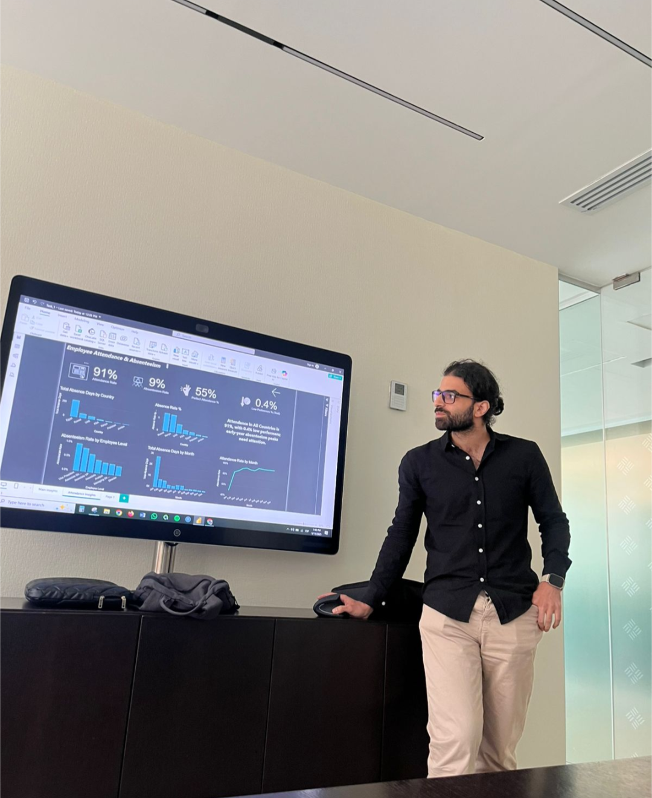

# HR Attendance & Absenteeism Dashboard (EFG Internship Project)

This Power BI dashboard was built as part of an internship task at EFG Holding. The goal was to analyze employee attendance data and present clear, high-level insights for HR leadership.

---

## Dashboard Preview

---

## Project Context

This project was completed during my internship at EFG Holding as part of an HR analytics task.  
The objective was to summarize employee attendance behavior, highlight patterns, and surface early warning signs for absenteeism.

---

## Key KPIs

- Attendance Rate
- Absenteeism Rate
- Perfect Attendance %
- Low Performers %

---

## What the dashboard shows

- Total absence days by country
- Absenteeism rate by country
- Monthly absence trends
- Monthly attendance trends
- High-level written insight summary

---

## Presentation Snapshot

This image shows me presenting the dashboard and insights.

---

## Tools Used

- Power BI
- Power Query
- DAX
- Excel / CSV

---

## How to open this project

1. Download or clone this repository
2. Open `dashboard/Task_1_HR.pbix`
3. If prompted, link the file to the dataset in the `data` folder

---

## Notes

This is a learning and internship project. The data and insights are for demonstration purposes only.
